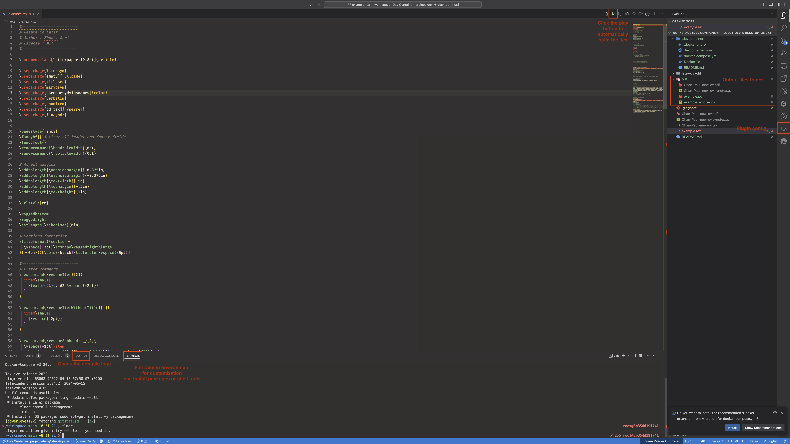

# Simple LaTeX development under VSCode and docker
Simple, out of the box and customizable
From the project [qdm12/latexdevcontainer](https://github.com/qdm12/latexdevcontainer) with a few extra setups. This is just personal use.
For more details, please refer to [qdm12/latexdevcontainer](https://github.com/qdm12/latexdevcontainer)
Big shoutout to `qdm12`!!!

## Updates from the default setup:
1. Installed texlive-latex-extra and texlive-fonts-recommended
2. Setup Timezone=Asia/HongKong
3. Extra config for `latex-workshop` plugin.

## Setup for a Project:
1. Copy the `.devcontainer` to your project
2. Open the command palette in Visual Studio Code (CTRL+SHIFT+P) and select `Remote-Containers: Open Folder in Container...` and choose your project directory
3. Wait the image pull and the container built.
4. Edit your `file.tex` and build it with `latex-workshop`

## References and Thanks
- qdm12/latexdevcontainer](https://github.com/qdm12/latexdevcontainer)
- [James-Yu/LaTeX-Workshop](https://github.com/James-Yu/LaTeX-Workshop/tree/master)
